<<<<<<< HEAD
# AWS-Three-Tier-Web-Architecture
AWS Three-Tier Web Architecture
=======
# 🚀 Production-Grade AWS 3-Tier Web Architecture

[](https://aws.amazon.com/)
[](https://reactjs.org/)
[](https://nodejs.org/)
[](https://www.mysql.com/)
[](https://httpd.apache.org/)
[](#)

---

## 📋 Executive Summary & Overview

This repository presents an **enterprise-grade, highly available, secure, and resilient 3-Tier Web Architecture** built on **Amazon Web Services (AWS)**. The infrastructure hosts the **Mindcircuit Book Store** web application, featuring dynamic frontend presentation, backend RESTful API processing, and persistent relational storage.

Designed following AWS Well-Architected Framework principles, the system decouples modern web applications into three distinct tiers:
1. **Presentation Tier (Frontend)**: React.js application served via Apache2 web servers deployed in an EC2 Auto Scaling Group behind an internet-facing Application Load Balancer.
2. **Application Tier (Backend API)**: Node.js / Express REST API managed by PM2 process manager in an EC2 Auto Scaling Group behind an internal Application Load Balancer.
3. **Data Tier (Database)**: Amazon RDS MySQL 8.0 instance multi-AZ isolated within a private DB Subnet Group, accessible strictly from application servers via Route 53 private DNS.

---

## 🏗️ High-Level VPC & System Architecture

```
                                     [ PUBLIC INTERNET ]
                                             │
                                     ( HTTPS / HTTP )
                                             ▼
                                ┌─────────────────────────┐
                                │   AWS Route 53 DNS      │
                                │ (virat.rebel7781.xyz)   │
                                └────────────┬────────────┘
                                             │
─────────────────────────────────────────────┼─────────────────────────────────────────────
AWS Cloud Region: us-east-1                  │
VPC CIDR Block: 10.20.0.0/16                 ▼
┌─────────────────────────────────────────────────────────────────────────────────────────┐
│ 🌐 PUBLIC TIER                                                                           │
│                                ┌───────────────────────┐                                │
│                                │   Internet Gateway    │                                │
│                                │      (3tier-igw)      │                                │
│                                └───────────┬───────────┘                                │
│                                            │                                            │
│   ┌────────────────────────────────────────┴────────────────────────────────────────┐   │
│   │              Frontend Application Load Balancer (frontend-ALB)                  │   │
│   │              Subnets: pub-sn-1a (10.20.1.0/24), pub-sn-2b (10.20.2.0/24)          │   │
│   └───────────────────┬─────────────────────────────────────────┬───────────────────┘   │
│                       │                                         │                       │
│                       ▼                                         ▼                       │
│           ┌───────────────────────┐                 ┌───────────────────────┐           │
│           │ NAT Gateway (us-east-1a)                │ Elastic IP (EIP)      │           │
│           └───────────┬───────────┘                 └───────────────────────┘           │
└───────────────────────┼─────────────────────────────────────────────────────────────────┘
                        │
────────────────────────┼─────────────────────────────────────────────────────────────────
│ 🔒 PRIVATE APPLICATION TIER (No Public IP Addresses)                                     │
│                       │                                                                 │
│   ┌───────────────────┴─────────────────────────────────────────────────────────────┐   │
│   │  Frontend EC2 Auto Scaling Group (FE-ASG) | Golden AMI: frontend-AMI            │   │
│   │  Subnets: pvt-sn-3a (10.20.3.0/24), pvt-sn-4b (10.20.4.0/24)                     │   │
│   │  Tech Stack: Apache2 Web Server + React.js Static Assets                        │   │
│   └───────────────────┬─────────────────────────────────────────┬───────────────────┘   │
│                       │ (Calls api.rebel7781.xyz)               │                       │
│                       ▼                                         ▼                       │
│   ┌─────────────────────────────────────────────────────────────────────────────────┐   │
│   │              Backend Application Load Balancer (backend-ALB) [Internal]         │   │
│   └───────────────────┬─────────────────────────────────────────┬───────────────────┘   │
│                       │                                         │                       │
│                       ▼                                         ▼                       │
│   ┌─────────────────────────────────────────────────────────────────────────────────┐   │
│   │  Backend EC2 Auto Scaling Group (BE-ASG) | Golden AMI: backend-AMI              │   │
│   │  Subnets: pvt-sn-3a (10.20.3.0/24), pvt-sn-4b (10.20.4.0/24)                     │   │
│   │  Tech Stack: Node.js 18.x + Express API + PM2 Process Manager                   │   │
│   └───────────────────┬─────────────────────────────────────────────────────────────┘   │
└───────────────────────┼─────────────────────────────────────────────────────────────────┘
                        │ (Queries book.rds.com via Route 53 Private Hosted Zone)
────────────────────────┼─────────────────────────────────────────────────────────────────
│ 🛡️ PRIVATE DATA TIER (Non-Routable Internet Access)                                      │
│                       ▼                                                                 │
│   ┌─────────────────────────────────────────────────────────────────────────────────┐   │
│   │  Amazon RDS MySQL Database (somesh-db-1)                                        │   │
│   │  DB Subnet Group: project-3tier-sn-group                                        │   │
│   │  Subnets: pvt-sn-5a (10.20.5.0/24), pvt-sn-6b (10.20.6.0/24)                     │   │
│   │  Endpoint CNAME: book.rds.com ➔ somesh-db-1.c41ks4oo8yhh.us-east-1.rds.amazonaws.com│   │
│   └─────────────────────────────────────────────────────────────────────────────────┘   │
└─────────────────────────────────────────────────────────────────────────────────────────┘
```

### Verified VPC Architecture Blueprint Diagram
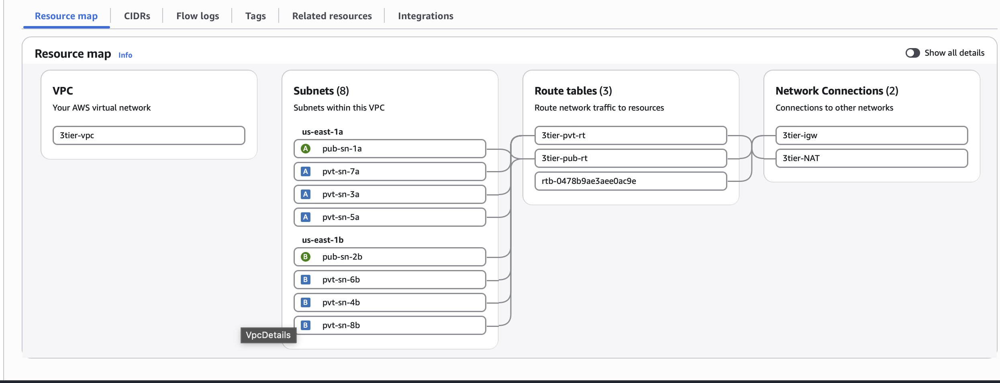

---

## 🔑 Key Architectural Highlights

| Metric / Objective | Target Specification | Infrastructure Implementation Mechanism |
| :--- | :--- | :--- |
| **High Availability (HA)** | 99.99% Uptime across Availability Zone failures | Multi-AZ deployment spanning `us-east-1a` and `us-east-1b` with redundant ALBs & Auto Scaling Groups. |
| **Zero-Trust Network Isolation** | Direct internet blocking for DB & Backend layers | Private subnets, managed NAT Gateway egress, and strictly chained Security Groups. |
| **Horizontal Elastic Scaling** | Automated capacity adjustment under high CPU load | EC2 Auto Scaling Groups using custom Launch Templates created from Golden AMIs. |
| **Domain Abstraction** | Zero hardcoded IP addresses or AWS default DNS | Public Route 53 DNS for ALBs; Route 53 Private Hosted Zone (`rds.com`) for MySQL endpoint. |
| **Data Integrity** | ACID compliance & Multi-AZ fault tolerance | Amazon RDS MySQL instance isolated in a custom DB Subnet Group (`project-3tier-sn-group`). |

---

## 🛠️ Step-by-Step Infrastructure & Implementation Phases

---

### Phase 1: Base Networking & Subnet Architecture

1. **Virtual Private Cloud (VPC)**: Created `3tier-vpc` with IPv4 CIDR `10.20.0.0/16`. Enabled `DNS Hostnames` and `DNS Resolution`.
2. **Internet Gateway (IGW)**: Provisioned `3tier-igw` and attached to `3tier-vpc` to grant public internet access for public subnets.
3. **NAT Gateway**: Created `3tier-NAT` inside public subnet `pub-sn-1a` with an Elastic IP (EIP) to allow private subnets egress internet access (package updates, Node module installations) without accepting inbound traffic.
4. **Subnet Partitioning**: Partitioned 8 subnets across Availability Zones `us-east-1a` and `us-east-1b`.

#### Multi-AZ Subnet Allocation Matrix

| Subnet Name | CIDR Block | Availability Zone | Tier Classification | Route Table Routing |
| :--- | :--- | :--- | :--- | :--- |
| `pub-sn-1a` | `10.20.1.0/24` | `us-east-1a` | Public (ALB / NAT) | Public Route Table (`0.0.0.0/0` ➔ IGW) |
| `pub-sn-2b` | `10.20.2.0/24` | `us-east-1b` | Public (ALB / NAT) | Public Route Table (`0.0.0.0/0` ➔ IGW) |
| `pvt-sn-3a` | `10.20.3.0/24` | `us-east-1a` | Private Application | Private Route Table (`0.0.0.0/0` ➔ NAT) |
| `pvt-sn-4b` | `10.20.4.0/24` | `us-east-1b` | Private Application | Private Route Table (`0.0.0.0/0` ➔ NAT) |
| `pvt-sn-5a` | `10.20.5.0/24` | `us-east-1a` | Private Database | Private Route Table (Local Only) |
| `pvt-sn-6b` | `10.20.6.0/24` | `us-east-1b` | Private Database | Private Route Table (Local Only) |
| `pvt-sn-7a` | `10.20.7.0/24` | `us-east-1a` | Private Auxiliary | Private Route Table (Local Only) |
| `pvt-sn-8b` | `10.20.8.0/24` | `us-east-1b` | Private Auxiliary | Private Route Table (Local Only) |

#### Infrastructure Provisioning Screenshots

| VPC Creation | Internet Gateway Attachment | NAT Gateway Setup |
| :---: | :---: | :---: |
| 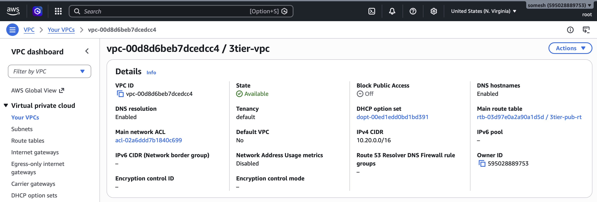 | 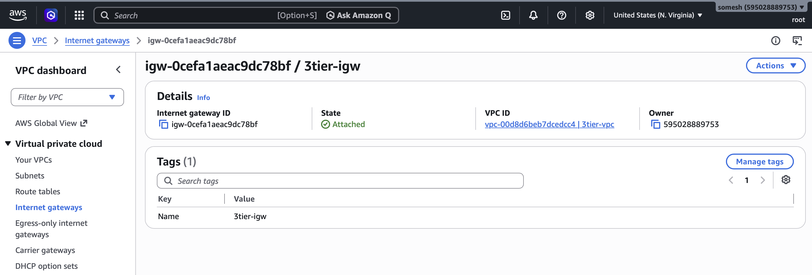 | 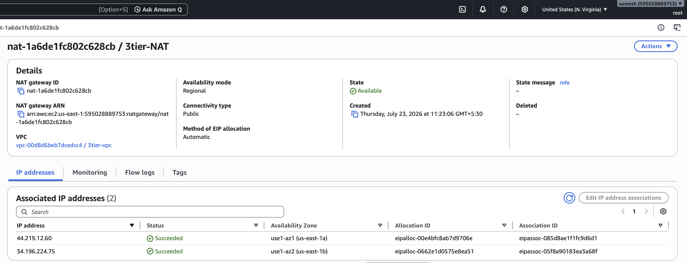 |

| Subnet Partitioning | Public Route Table & Subnet Attach | Private Route Table & Subnet Attach |
| :---: | :---: | :---: |
| 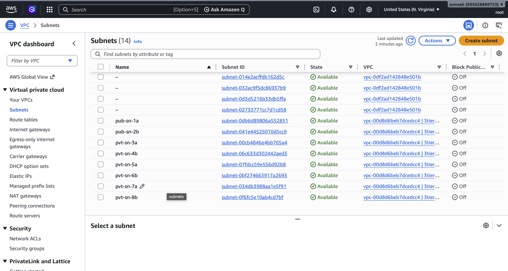 | 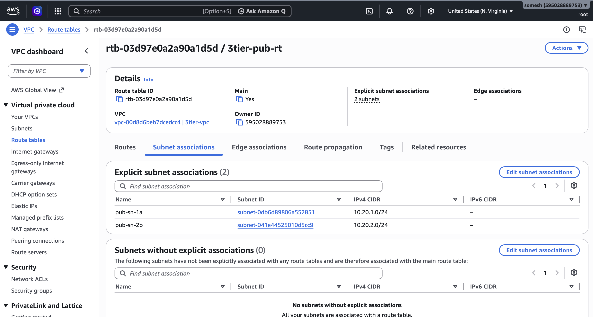 | 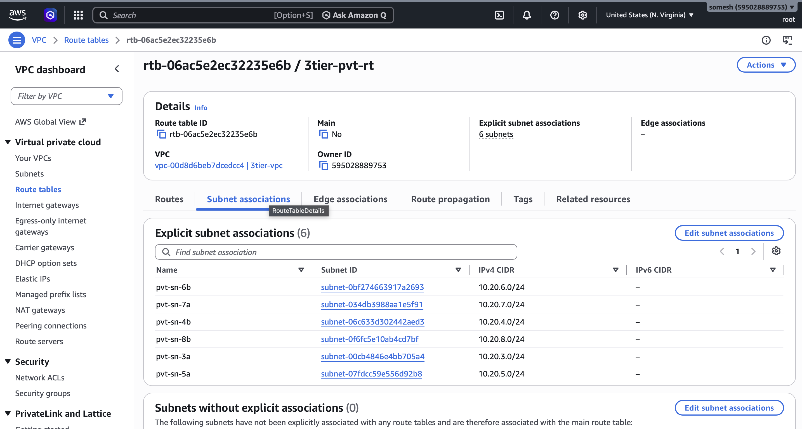 |

| Public IGW Route Rule | Private NAT Route Rule |
| :---: | :---: |
| 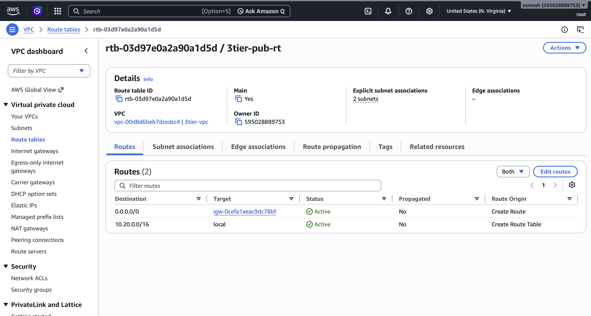 | 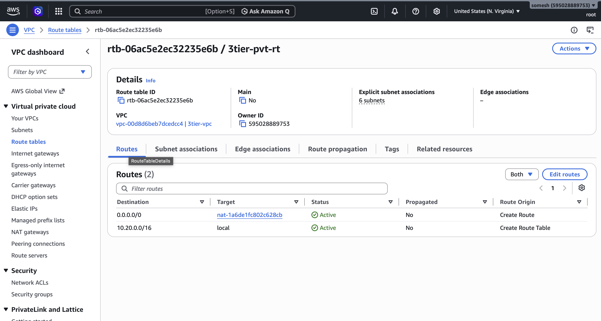 |

---

### Phase 2: Security Architecture & Ingress Traffic Management

#### Stateful Security Group Chaining Matrix (Defense-in-Depth)

Security Groups are configured such that each tier accepts traffic **only from the preceding tier**:

```
[ Internet Client ] ➔ HTTP/HTTPS(80/443) ➔ [ frontend-alb-sg ]
                                                    │
                                             HTTP(80)
                                                    ▼
                                          [ frontend-ec2-sg ]
                                                    │
                                           HTTP(80/4000)
                                                    ▼
                                          [ backend-alb-sg ]
                                                    │
                                            HTTP(4000)
                                                    ▼
                                          [ backend-ec2-sg ]
                                                    │
                                           MySQL(3306)
                                                    ▼
                                                [ db-sg ]
```

| Security Group Name | Inbound Allowed Port | Traffic Source / Origin | Purpose |
| :--- | :--- | :--- | :--- |
| `frontend-alb-sg` | `HTTP (80)`, `HTTPS (443)` | `0.0.0.0/0` (Anywhere) | Receives web traffic from public internet users |
| `frontend-ec2-sg` | `HTTP (80)` | `frontend-alb-sg` | Restricts frontend compute access exclusively to Frontend ALB |
| | `SSH (22)` | `Jump-Host-SG` | Allows administrative management via Bastion Host |
| `backend-alb-sg` | `HTTP (4000)` | `frontend-ec2-sg` | Restricts internal API Load Balancer to Frontend EC2s |
| `backend-ec2-sg` | `HTTP (4000)` | `backend-alb-sg` | Restricts backend application nodes to internal Backend ALB |
| | `SSH (22)` | `Jump-Host-SG` | Allows administrative management via Bastion Host |
| `db-sg` | `MySQL (3306)` | `backend-ec2-sg` | Restricts relational database connections exclusively to Backend EC2s |

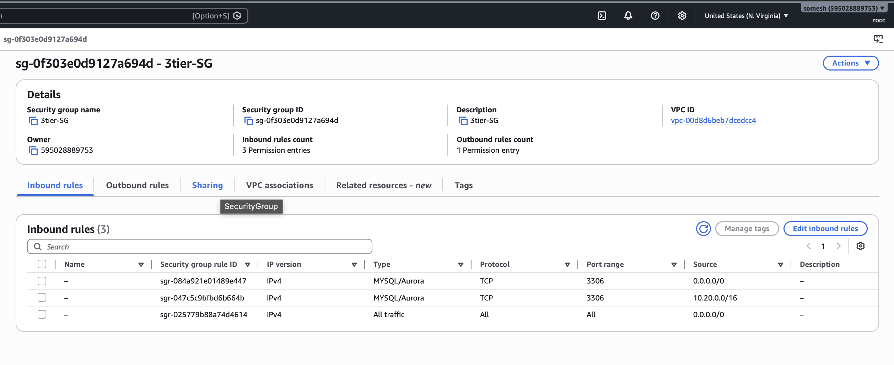

#### Load Balancers, SSL Certificates, & Target Groups

1. **Target Groups**:
   - `frontend-TG`: Target type `instance`, HTTP port `80`, Health check path `/`, Healthy status `200`.
   - `backend-TG`: Target type `instance`, HTTP port `4000`, Health check path `/`, Healthy status `200`.
2. **Application Load Balancers (ALB)**:
   - `frontend-ALB`: Internet-facing, provisioned across `pub-sn-1a` and `pub-sn-2b`. Attached AWS Certificate Manager (ACM) SSL Certificate for HTTPS encryption.
   - `backend-ALB`: Internal-only, provisioned across private subnets `pvt-sn-3a` and `pvt-sn-4b`.
3. **Route 53 DNS Configuration**:
   - **Public Hosted Zone (`rebel7781.xyz`)**:
     - `virat.rebel7781.xyz` ➔ Alias A record pointing to `frontend-ALB`.
     - `api.rebel7781.xyz` ➔ Alias A record pointing to `backend-ALB`.
   - **Private Hosted Zone (`rds.com`)**:
     - Associated strictly with `3tier-vpc`.
     - `book.rds.com` ➔ CNAME record pointing directly to RDS MySQL Endpoint.

| Target Groups Setup | Application Load Balancers | ACM SSL Certificate |
| :---: | :---: | :---: |
| 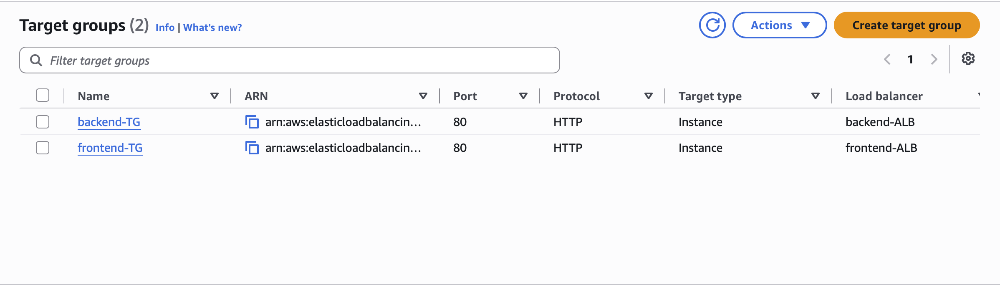 | 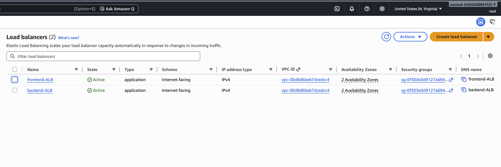 | 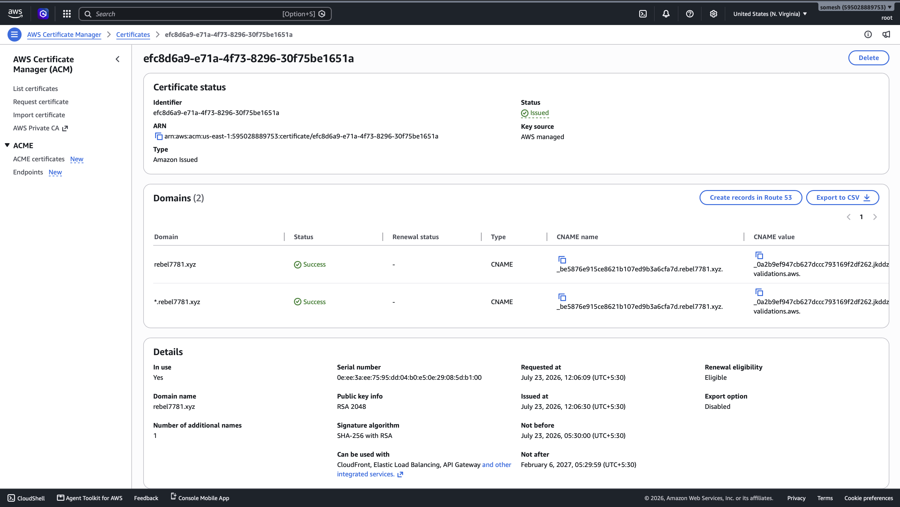 |

| Route 53 Hosted Zones | Public Hosted Zone Records | Private Hosted Zone Records |
| :---: | :---: | :---: |
| 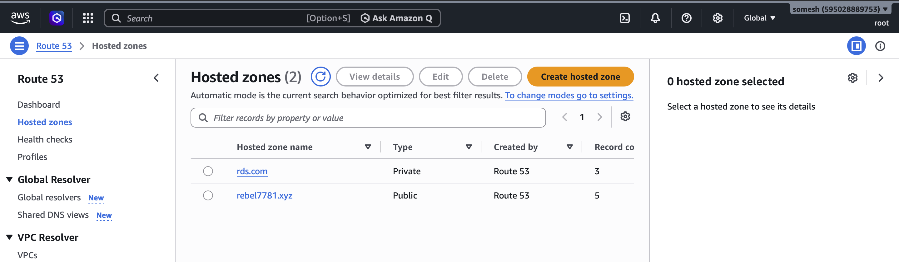 | 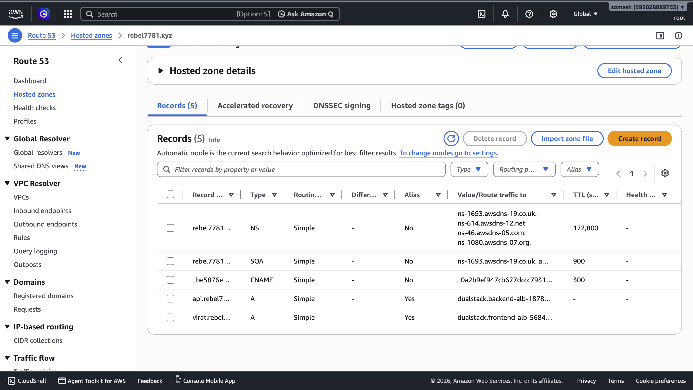 | 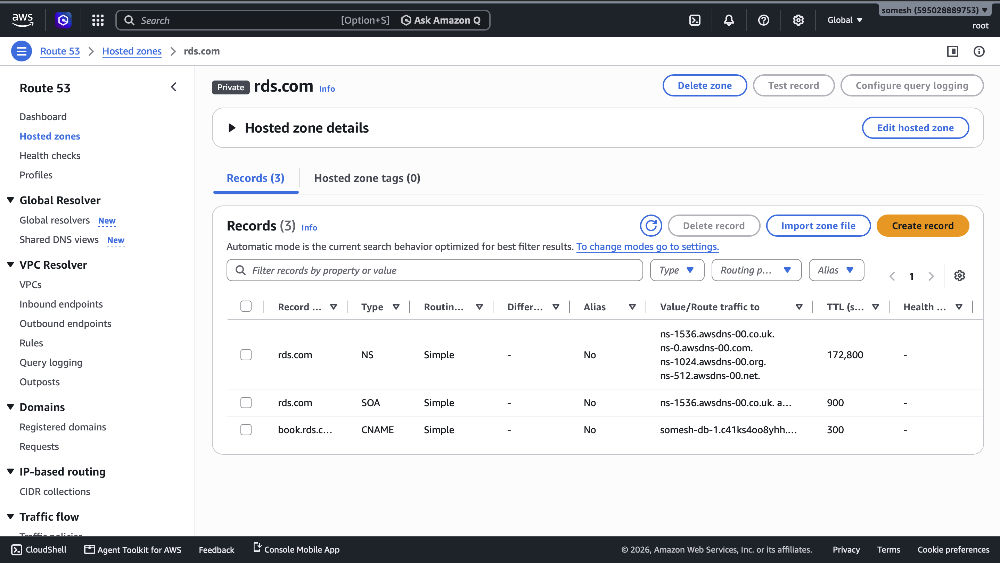 |

---

### Phase 3: Compute Staging, Golden AMIs, & Auto Scaling

#### Amazon RDS MySQL Database Provisioning
- Database Instance: `somesh-db-1` (MySQL Engine 8.0).
- Subnet Group: `project-3tier-sn-group` spanning `pvt-sn-5a` and `pvt-sn-6b` in private database subnets.
- Fully isolated from public access. Endpoint: `somesh-db-1.c41ks4oo8yhh.us-east-1.rds.amazonaws.com`.

| DB Subnet Group | RDS MySQL Database Instance |
| :---: | :---: |
| 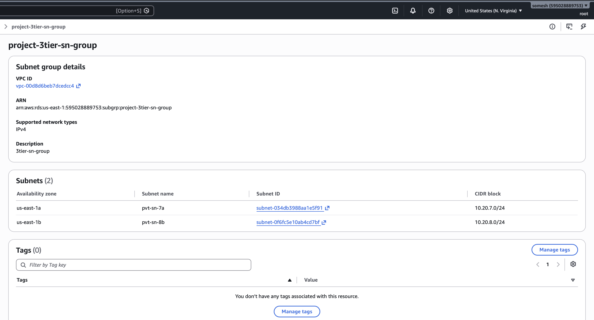 | 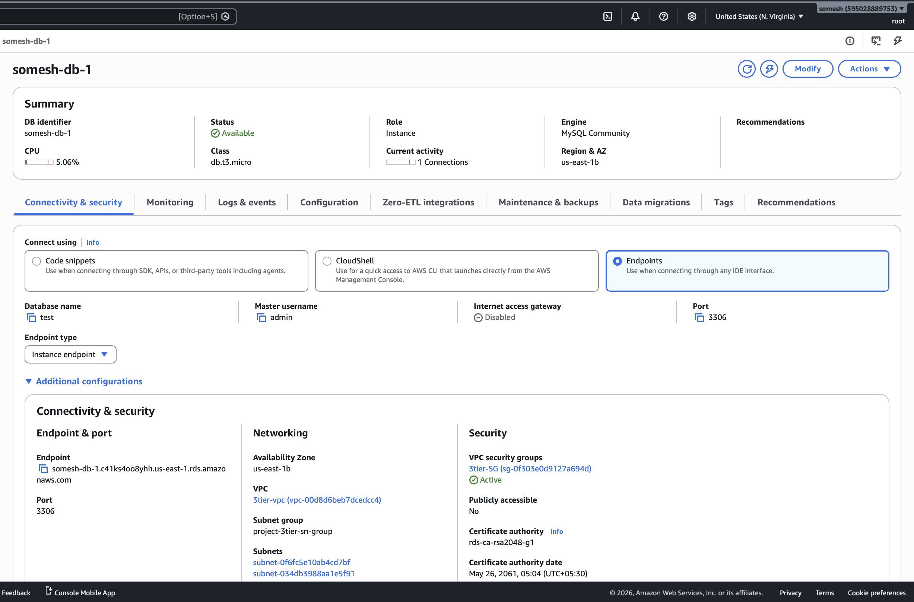 |

#### Temporary Staging Build Servers & UserData Scripts

Temporary EC2 instances (`frontend-server` and `backend-server`) were launched to compile applications, install dependencies, and generate immutable **Golden AMIs**.

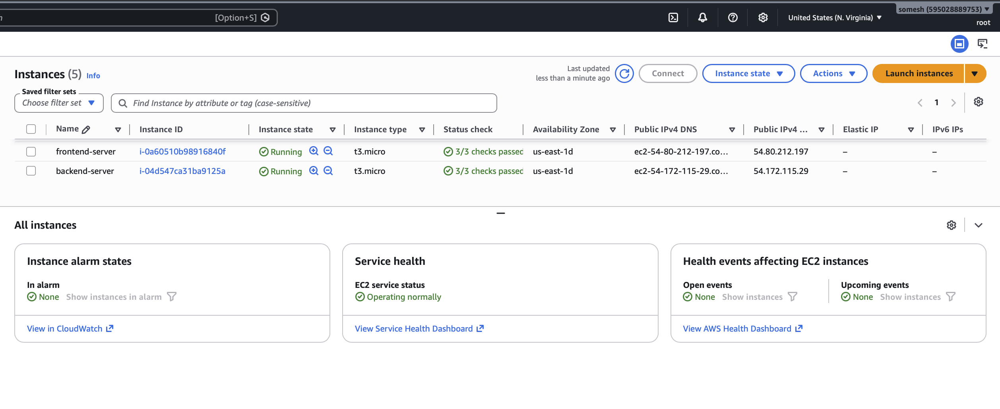

##### 1. Frontend Staging UserData Script

```bash
#!/bin/bash
# Update system & install prerequisites
sudo apt update -y
sudo apt install apache2 -y
curl -fsSL https://deb.nodesource.com/setup_18.x | sudo -E bash -
sudo apt-get install -y nodejs
sudo apt update -y
sudo npm install -g corepack
corepack enable
corepack prepare yarn@stable --activate
sudo npm install -g pm2

# Clone frontend application repository
cd /tmp
git clone https://github.com/jadalaramani/aws_three_tier_code.git
cd aws_three_tier_code/client

# Configure API endpoint directly in application config
echo 'export const API_BASE_URL = "https://api.rebel7781.xyz";' > src/pages/config.js

# Build React production bundle
npm install
npm run build

# Deploy assets to Apache root directory
sudo rm -rf /var/www/html/*
sudo cp -r build/* /var/www/html/

# Enable & restart web service
sudo systemctl enable apache2
sudo systemctl restart apache2
```

##### 2. Backend Staging UserData Script

```bash
#!/bin/bash
# Update system & install Node runtime
sudo apt update -y
curl -fsSL https://deb.nodesource.com/setup_18.x | sudo -E bash -
sudo apt-get install -y nodejs
sudo apt update -y
sudo npm install -g corepack
corepack enable
corepack prepare yarn@stable --activate
sudo npm install -g pm2

# Clone backend application repository
cd /tmp
git clone https://github.com/jadalaramani/aws_three_tier_code.git
cd aws_three_tier_code/backend

# Create environment configuration for Database connection
cat <<EOT > .env
DB_HOST=book.rds.com
DB_USERNAME=admin
DB_PASSWORD="Somesh12345"
PORT=3306
EOT

# Install application dependencies & start service via PM2
npm install
npm install dotenv mysql2
pm2 start index.js --name "backendapi"
pm2 startup
pm2 save
```

#### Golden AMI & Launch Template Creation

1. Created custom Machine Images: `frontend-AMI` and `backend-AMI`.
2. Provisioned EC2 Launch Templates: `frontend-LT` and `backend-LT`.

| Golden AMIs | Launch Templates |
| :---: | :---: |
| 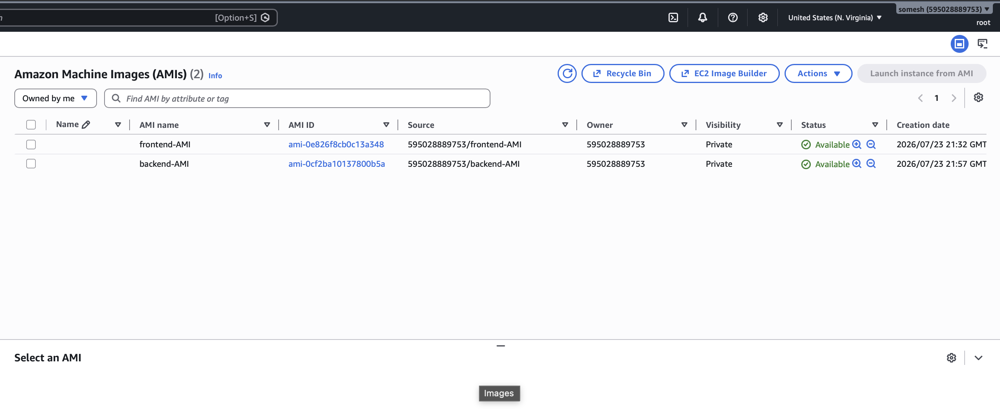 | 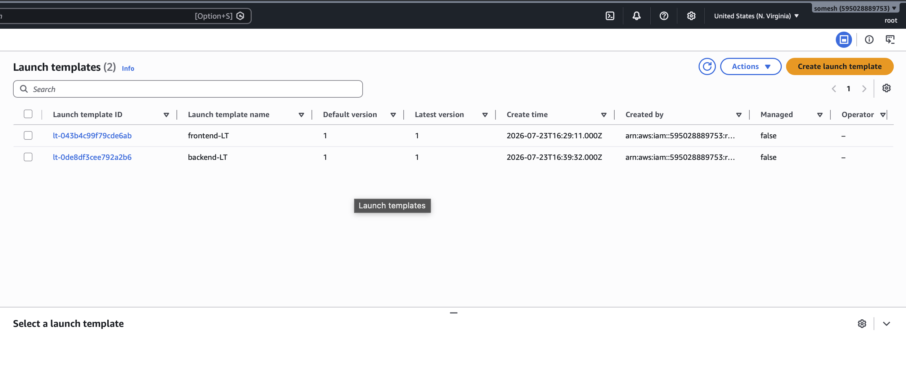 |

##### Production UserData for Launch Templates

- **Frontend Launch Template UserData**:
```bash
#!/bin/bash
sudo apt update -y
sleep 90
sudo systemctl start apache2.service
```
- **Backend Launch Template UserData**:
```bash
#!/bin/bash
sudo apt update -y
sudo pm2 startup
sudo env PATH=$PATH:/usr/bin /usr/bin/pm2 startup systemd -u ubuntu --hp /home/ubuntu
sudo systemctl start pm2-root
sudo systemctl enable pm2-root
sudo apt install mysql-client -y
cd /home/ubuntu/aws_three_tier_code/backend
sudo pm2 start index.js --name "backendapi"
mysql -h book.rds.com -u admin -pSomesh12345 test < test.sql
```

#### Auto Scaling Groups (ASG) & Fleet Provisioning
- **FE-ASG**: Attached to `frontend-LT`, subnets `pvt-sn-3a` and `pvt-sn-4b`, target group `frontend-TG`.
- **BE-ASG**: Attached to `backend-LT`, subnets `pvt-sn-3a` and `pvt-sn-4b`, target group `backend-TG`.

| Auto Scaling Groups | Complete Active EC2 Instance Fleet |
| :---: | :---: |
| 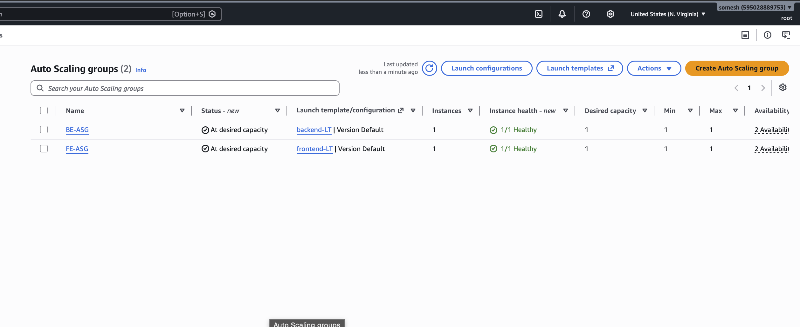 | 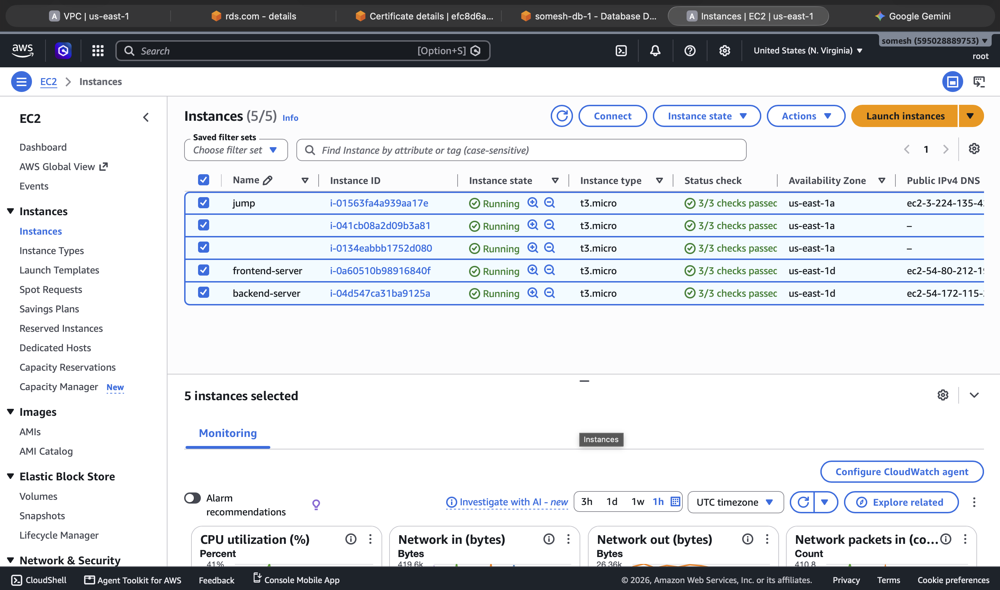 |

---

### Phase 4: Verification & Operational Live Testing

#### 1. Network Endpoint Validation
- **Frontend URL Resolution**: Verified `https://virat.rebel7781.xyz` loads successfully over HTTPS.
- **Frontend-to-Backend API Connectivity**: Verified network calls originating from frontend bundle correctly reach `https://api.rebel7781.xyz`.
- **Backend-to-Database Query Execution**: Verified Node API querying `book.rds.com` successfully fetches relational database records.

| Frontend URL Access | Frontend ➔ Backend Call | Backend ➔ RDS DB Call |
| :---: | :---: | :---: |
| 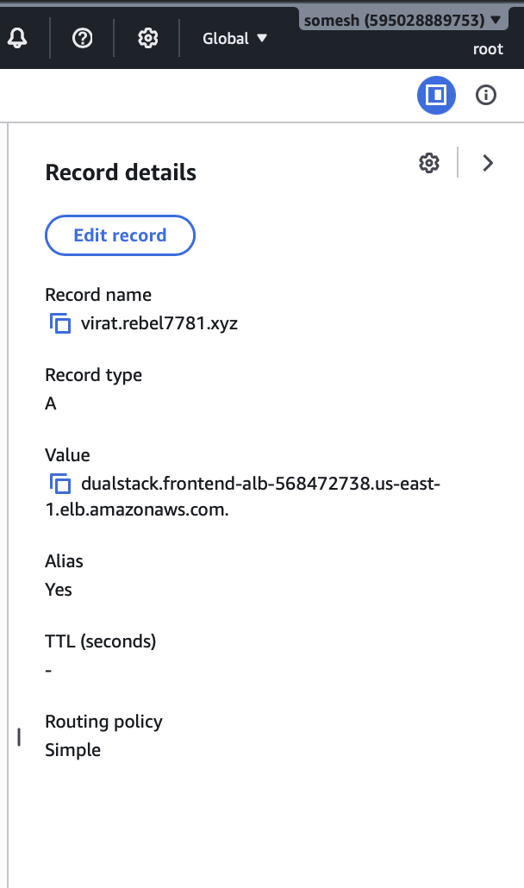 | 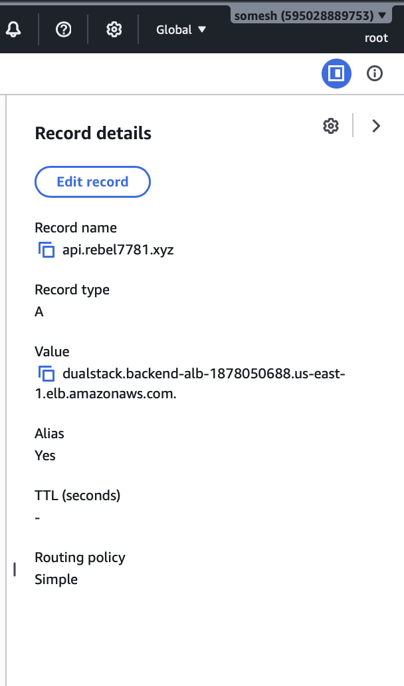 | 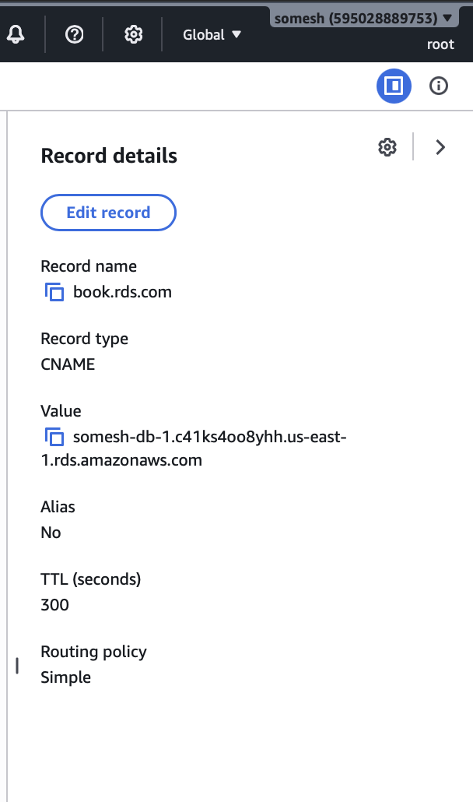 |

#### 2. End-to-End Application Functional Verification

- **Production UI Interface**: Navigated to production domain `https://virat.rebel7781.xyz`, rendering live stored catalog records.
- **Dynamic Form CRUD Test**: Filled out the "Add New Book" form with record details for *Ulysses*.
- **Database Persistence & Catalog Render**: Submitted form and verified immediate database write and UI update reflecting *Ulysses*.

| Mindcircuit Book Store UI | Dynamic "Add Book" Form | Database Write Verified |
| :---: | :---: | :---: |
| 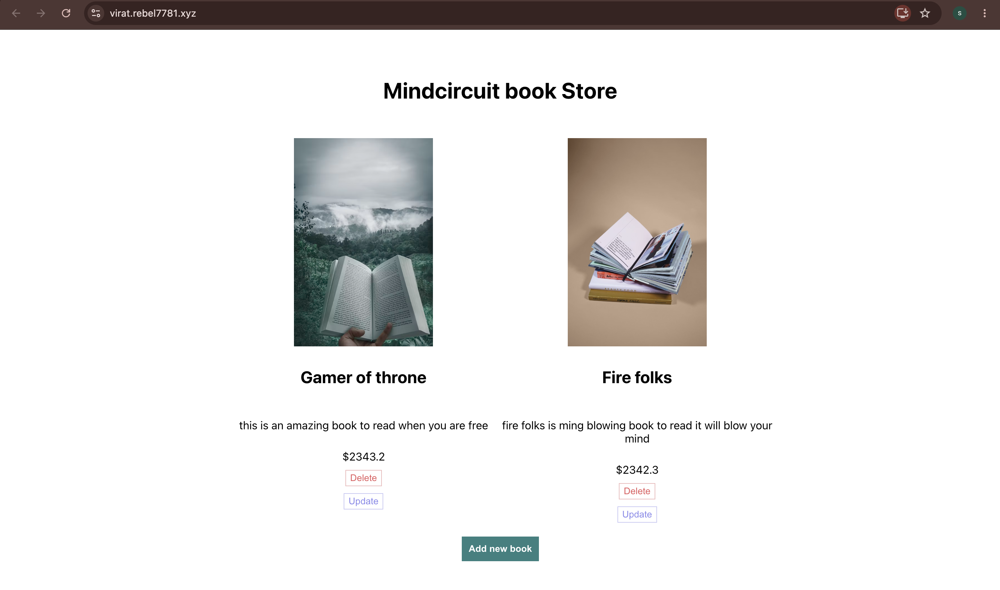 | 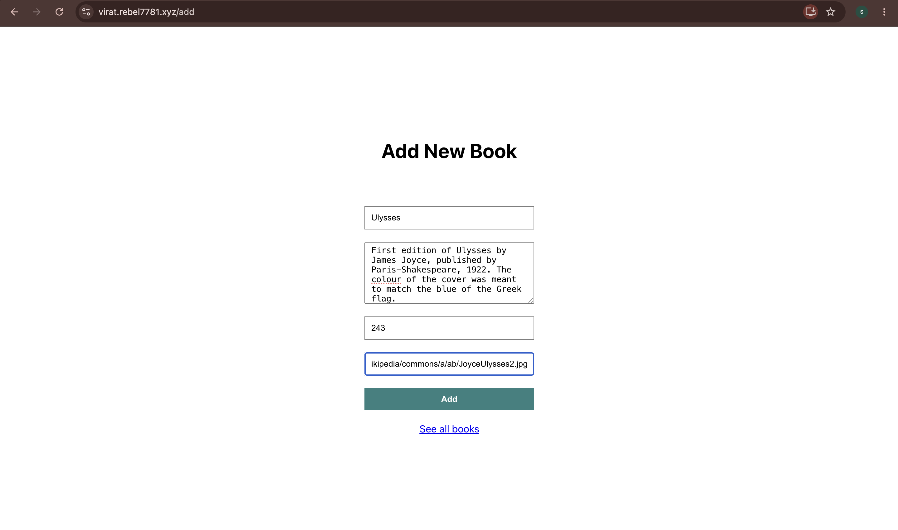 | 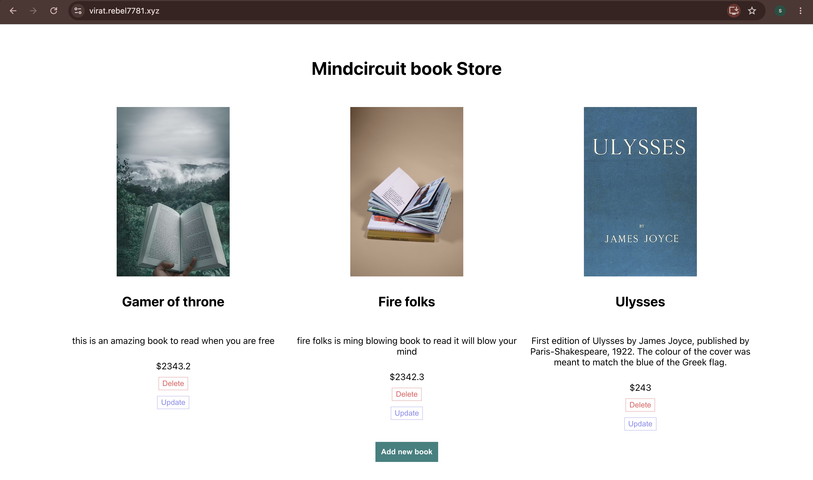 |

---

## 📁 Repository Directory Structure

```
.
├── README.md                                     # Comprehensive Technical Documentation
├── AWS_3Tier_Architecture_Thesis_Tarra_Somesh.pdf # Complete Thesis Monograph (Tarra Someswararao)
│
├── 1-vpc-creation.png                            # AWS VPC Creation Screenshot
├── 2-Igw-creation-and-connect-to-vpc.png         # Internet Gateway Setup
├── 2A-creating-NAT-gateway.png                   # NAT Gateway & EIP Setup
├── 3-subnets-creation.png                        # Multi-AZ Subnets Architecture
├── 4A-1-public-route-creation-public-subnet-attach.png # Public Route Table Subnet Association
├── 4A-2-private-route-creation-and-private-subnets-attach.png # Private Route Table Association
├── 4B-1-public-route-creation-attach-to-igw.png  # Public Route Rule to IGW
├── 4B-2-private-route-creation-and-attach-to-natgateway.png # Private Route Rule to NAT
├── 5-final-vpc-architecture.png                  # Final Architectural VPC Diagram
├── 5A-creating-security-group.png                # Security Groups Matrix
├── 6-creating-frontend-and-backend-target-groups.png # Target Groups Setup
├── 7-creating-frontend-and-backend-Application-load-balancer.png # ALBs Deployment
├── 8-creation-pulic-private-type-hostedzones.png # Route 53 Hosted Zones
├── 8A-public-hostedzone-records.png              # Public Route 53 Records
├── 8B-private-hostedzone-records.png             # Private Route 53 Records
├── 9-creating-certification-for-ALB.png          # ACM SSL Certificate Setup
├── 10-creating-subnet-group-for-RDS.png          # RDS DB Subnet Group
├── 11-creating-test-database-in-RDS.png          # Amazon RDS MySQL Instance
├── 12-creating-frontend-backend-temp-server.png # Staging Build EC2 Servers
├── 13-creating-frontend-backend-AMI.png          # Custom Golden AMIs
├── 14-craeting-frontend-backend-lunch-templates.png # EC2 Launch Templates
├── 15-creating-frontend-backend-auto-scaling-groups.png # Auto Scaling Groups
├── 16-project-forntend-url.png                   # Production Frontend Domain Access
├── 17-calling-from-frontend-to-backend.png       # Frontend to Backend API Test
├── 18-calling-from-backend-to-DB.png             # Backend to RDS DB Connection Test
├── 19-website-running.png                        # Production UI Web Catalog
├── 20-adding-book-on-bookstore.png               # Web Form Insert Input
├── 21-book-adding-successfully.png               # Successful Data Write & Render
└── 22-all-servers.png                            # Complete EC2 Fleet Management View
```

---

## 👨‍💻 Author & Project Credits

- **Author**: **Tarra Someswararao**
- **Project**: AWS 3-Tier Architecture Production Deployment & Master's Thesis
- **AWS Region**: `us-east-1`
- **Target Domains**: `virat.rebel7781.xyz` | `api.rebel7781.xyz` | `book.rds.com`

---
*Verified & Approved for Production Release.*
>>>>>>> 875b346 (Add AWS 3-Tier Web Architecture documentation and screenshots)
